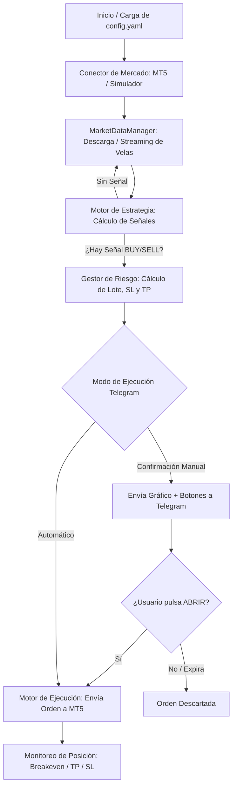

# 🤖 Bot de Trading Algorítmico Modular con Notificaciones en Telegram

Este proyecto es un bot de trading algorítmico profesional, modular y seguro desarrollado en Python. Permite conectarse tanto a **MetaTrader 5 (MT5)** en cuentas reales/demo como operar en modo de **simulación (Dry Run)**, con supervisión e interactividad directa desde **Telegram**.

---

## 🚀 Características Principales

* **Conexión Híbrida**: Soporta brokers de MetaTrader 5 (ej. Pepperstone) y un simulador local incorporado para pruebas sin riesgo.
* **Alertas y Confirmación por Telegram**:
  * Envío automático de capturas de pantalla de los gráficos con niveles de entrada, Stop Loss y Take Profit señalizados.
  * **Modo Confirmación**: Envía botones interactivos (`🚀 ABRIR OPERACIÓN` / `❌ DESCARTAR`) a tu teléfono para que tú apruebes la orden antes de entrar al mercado.
  * **Modo Automático**: Ejecución inmediata con notificación instantánea al chat.
* **Motor de Estrategias Modulares**:
  * **RSI + Bandas de Bollinger**: Detección de zonas de sobrecompra/sobreventa y rebotes en bandas extremas.
  * **Cruce de Medias Móviles (EMA Cross)**: Cruces de tendencia (ej. EMA 9 / 21) filtrados por media tendencial (EMA 200).
  * **Supertrend**: Detección de seguimiento de tendencia basada en volatilidad (ATR).
* **Gestión de Riesgo Avanzada**:
  * Cálculo dinámico de lotaje por riesgo porcentual de capital o lote fijo.
  * Stop Loss adaptativo por volatilidad (**ATR**) o fijo en pips.
  * Take Profit automático calculado por ratio Riesgo:Beneficio (ej. 1:2).
  * Protección de ganancias: **Breakeven** automático y opción de **Trailing Stop**.
  * Filtro de **Spread Máximo** y límite de operaciones simultáneas por símbolo.
* **Interfaz Gráfica Integrada (Estilo TradingView)**:
  * Gráficos interactivos de velas con subpaneles para RSI y Oscilador Estocástico (%K y %D).
  * Visualización en tiempo real de órdenes abiertas y niveles de riesgo.

---

## 🏗️ ¿Cómo Funciona el Bot? (Flujo de Trabajo)



1. **Lectura de Configuración**: Carga de parámetros desde `config.yaml` (credenciales, temporalidades, pares y gestión de riesgo).
2. **Obtención de Datos**: El gestor de datos (`MarketDataManager`) actualiza las velas de forma incremental sin sobrecargar el conector.
3. **Evaluación de Estrategia**: En cada cierre de vela o intervalo de escaneo, se recalculan indicadores y se evalúan condiciones de entrada.
4. **Validación de Riesgo**: Se calcula el tamaño de lote exacto y las distancias de Stop Loss y Take Profit. Se comprueba que el spread sea aceptable.
5. **Notificación / Aprobación en Telegram**:
   * Si está en modo `confirmacion`, el bot genera una captura de gráfico con la proyección de la orden y te envía los botones interactivos al móvil.
   * Al pulsar **"ABRIR OPERACIÓN"**, el bot recibe el evento mediante un hilo en segundo plano (`getUpdates`) y lanza la orden inmediatamente al mercado.
6. **Gestión de la Posición**: El bot monitorea la operación abierta para mover automáticamente el Stop Loss a precio de entrada (Breakeven) en cuanto alcanza el objetivo preliminar.

---

## 📁 Estructura del Proyecto

* **`config.yaml`**: Archivo central de configuración (credenciales, activos, temporalidad, parámetros de indicadores y Telegram).
* **`main.py`**: Punto de entrada del bot completo con bucle de escaneo continuo.
* **`utils/telegram_notifier.py`**: Núcleo de notificaciones, captura de órdenes y botones interactivos de Telegram.
* **`core/market_connector.py`**: Abstracción para conectar con MetaTrader 5 o el entorno simulado.
* **`core/risk_manager.py`**: Lógica de cálculo de lotaje, Stop Loss y Take Profit.
* **`core/execution_engine.py`**: Gestión de apertura, modificación y cierre de órdenes en el broker.
* **`utils/chart_visualizer.py`**: Generador de gráficos de velas y paneles técnicos interactivos.

---

## ⚙️ Configuración Rápida

1. Abre `config.yaml` y configura tus credenciales:
   ```yaml
   broker:
     conector: "metatrader5"          # O "simulador"
     servidor: "Pepperstone-Demo"
     cuenta: TU_NUMERO_DE_CUENTA
     password: "TU_PASSWORD"
     modo_simulacion: false          # false para operar en MT5

   telegram:
     activo: true
     token_bot: "TU_TOKEN_DE_BOTFATHER"
     chat_id: "TU_CHAT_ID"
     modo_ejecucion: "confirmacion"   # "confirmacion" o "automatico"
     enviar_captura_pantalla: true
   ```

2. Instala los requerimientos:
   ```bash
   pip install -r requirements.txt
   ```

3. Ejecuta el bot:
   * **Modo estándar (Consola)**:
     ```bash
     python main.py
     ```
   * **Con ventana interactiva de gráficos**:
     ```bash
     python main.py --ui
     ```
   * **Probar conexión con Telegram únicamente**:
     ```bash
     python test_telegram.py
     ```
